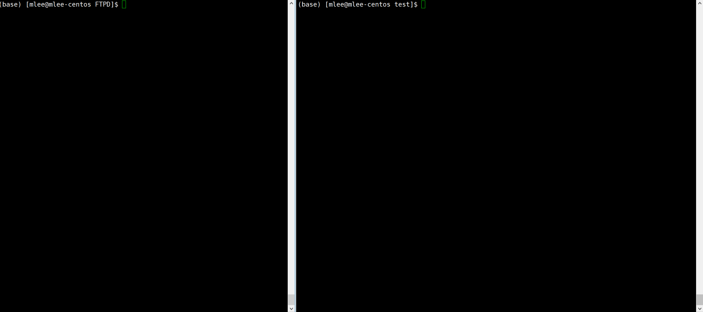

# MiniFTPD

## 介绍

一个 C++ 实现的 Linux Mini FTP Server

## 支持的功能

- 大部分的 FTP 命令
- 支持主被动传输模式
- 支持用户自定义配置信息
- 支持指定被动模式下数据端口的范围，考虑到了主机配置有防火墙的情况
- 支持文件上传/下载的断点续传
- 支持限速功能，防止服务过多占用带宽资源
- 限流，防 DDOS 攻击

## 快速运行此代码

### 可执行程序

下载 release 中的可执行程序包，解压，运行

### 源码编译

#### 环境依赖

1. Linux 主机
2. g++ 编译器
3. cmake 构建工具

#### 编译步骤

1. 在当前目录下，cmake 构建 makefile，执行命令: `cmake ./`
2. 编译构建: `make`，此时当前目录下生成可执行文件 `MiniFTPD`
3. 按需求设置配置文件 `config.yaml` 中的选项
4. 运行程序: `sudo ./MiniFTPD`
5. 若主机打开的有防火墙，请确保配置文件中用到的端口已在防火墙中打开
6. 客户端连接到此服务器，
    - ftp 客户端连接此服务器，默认的端口 2222
    - 登录，用户名及密码可以是服务器上的任一用户名及密码

7. 示例:
    - 服务器端启动服务

        ```plain
        cmake ./
        make
        sudo ./MiniFTPD
        ```

    - 本地 FTP 客户端连接到服务器
        若没有安装 ftp 客户端，可运行 `sudo yum install ftp` 安装ftp客户端

        ```plain
        > ftp
        > open 127.0.0.1 2222
        ```

    
